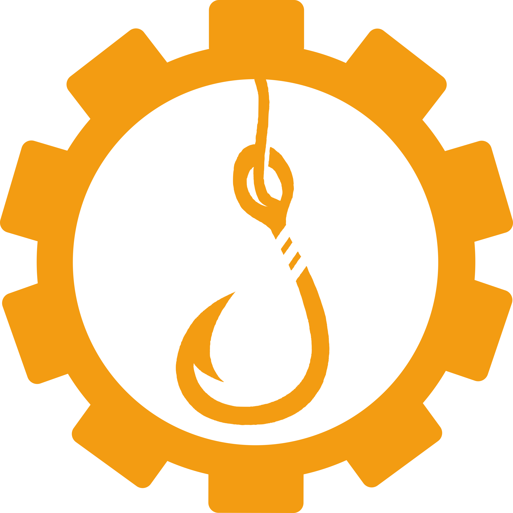
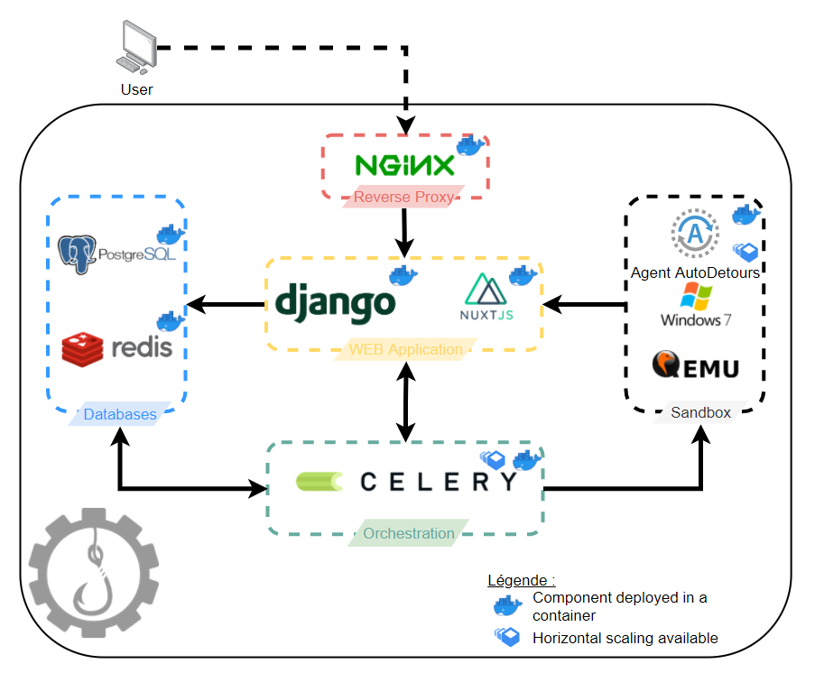

<p align="center">
  
</p>

[](https://github.com/Kn0wl3dge/AutoDetours/actions/workflows/backend.yml)
# AutoDetours

/!\ This project isn't ready for production:
* The API code needs some refacto and vulnerability fix (unlimited dataset generation without cleanup, killing any container from a fake worker and more)

## Introduction

AutoDetours is an application allowing to trace syscalls from multiple samples at the same time.

The goal is to be able to generate a large dataset of Windows API calls by malwares.
This dataset could then be used in machine learning to try to classify samples by families.
To provide this solution we are using [Detours](https://github.com/microsoft/Detours) project from Microsoft.

## Architecture
<p align="center">
  
</p>


## Installation

### Prerequisites

- [X] Docker installed and running
- [X] docker-compose
- [X] Python3 for the setup script

### Procedure
Just run `pip3 install -r requirements.txt` and `python3 setup.py -w <nbr_workers>` to install the project.  
This script will download, decompress and convert a Windows7 VM to a qcow2 image.  
Then, it will run the VM inside a container and configure the VM then install the agent and its dependencies.  
It will make a snapshot of the VM and setup the number of workers you want.  
Do not worry, it's going to take some time to finish...

## Running the projet
To run the project, just use the following command:
```
docker-compose up -d
```

## Usage
You can now launch the app on your favorite Browser and upload your samples. Once the treatment is done you can download the results list (in a JSON format) on your computer.
The application should be available at http://172.20.0.10/
